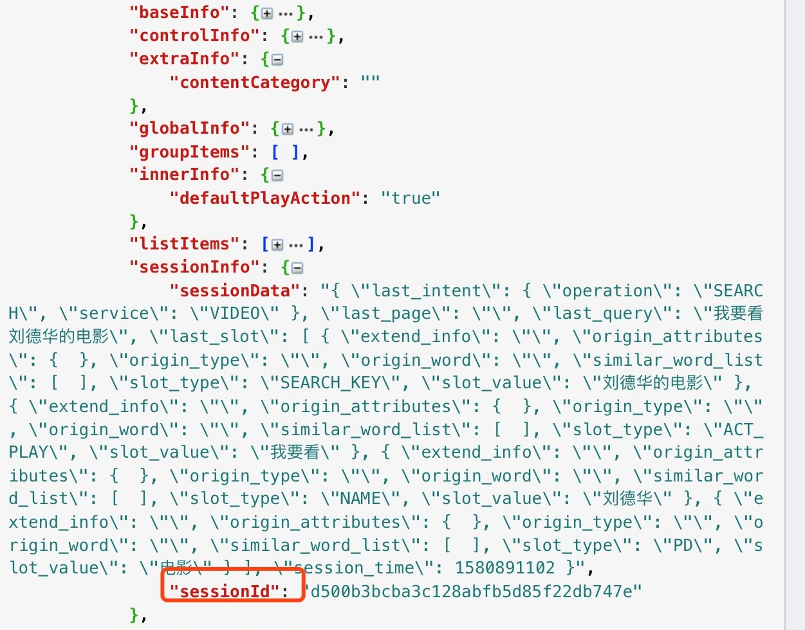

# 总体结构


```json
{
  "skill_vedio":{
      "qqvedio_session_info":{
          "session_id":"session_id",
          "session_data":"session_data"
      }
  }
}
```

| 参数名                        |   类型   | 是否必选 | 描述                                                         |
| ----------------------------- | :------: | :------: | ------------------------------------------------------------ |
| `skill_vedio`                 |    `object`      |    否    | 视频技能所需信息                                                     |
| `skill_vedio.qqvedio_session_info`    | `object` |    -     | 腾讯视频session信息。在使用腾讯视频SDK的场景下，在视频领域时，需要把视频领域返回的sessionInfo填到qqvedio_session_info中，见下图 |
| `skill_vedio.qqvedio_session_info.session_id`    | `string` |    -     | 腾讯视频session id     |
| `skill_vedio.qqvedio_session_info.session_data`    | `string` |    -     | 腾讯视频session data       |



