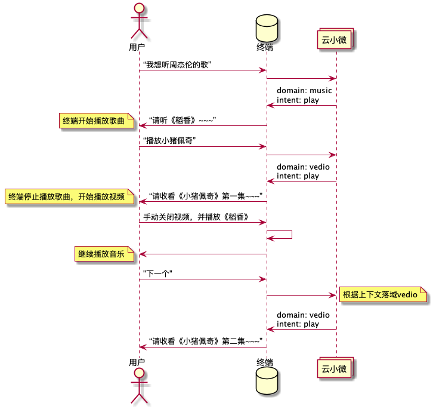
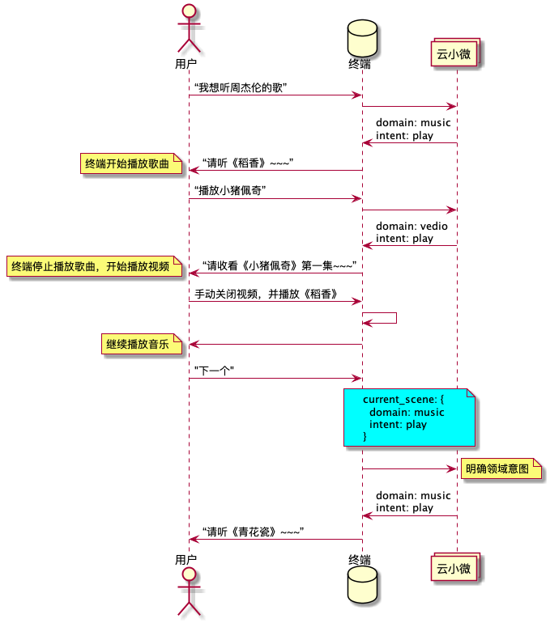

# richanswer接口中current_scene字段说明

在payload中增加

```
"current_scene":{
  "domain":"{{STRING}}",
  "intent":"{{STRING}}"
 }
```

该字段主要用于支持终端上传当前场景的真实领域意图。如果不上传该字段在如下所示场景可能会发生错误：



如图所示，当用户在听音乐的过程中，如果发起“视频”领域请求，会导致后续请求“下一个”时，云小微不明确当前query的领域意图，可能使得服务处理请求时发生错误。

增加current_scene字段可以帮助云小微明确当前query的领域意图，如图所示：



当用户在请求“下一首“时，终端请求会携带当前真实领域意图，当明确了领域和意图后，云小微会正常处理请求。
