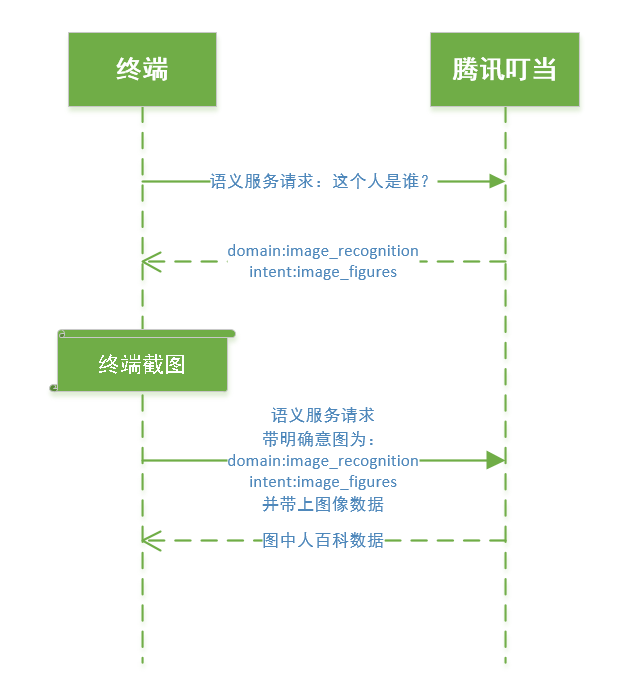

<h1>腾讯叮当图像识别流程</h1>

腾讯叮当提供人物图像识别能力。使用流程如下：

使用图像识别的先置条件：bot开启图像识别领域。

涉及接口：语义服务接口，URL为`https://aiwx.html5.qq.com/api/v1/richanswer`。具体请见<<腾讯叮当HTTP方式接入API文档>>。

步骤如下：

1. 用户语音输入，识别结果为：这个人是谁？

2. 终端用语音识别结果作为query请求腾讯叮当语义服务接口(`v1/richanswer`)。

3. 腾讯叮当后台返回语义结果，领域为image_recognition，意图为image_figures。

4. 终端遇到上面的领域和意图，应当对屏幕进行截图。

5. 终端调用腾讯叮当语义服务接口(`v1/richanswer`)，填充`payload.semantic`字段，`payload.semantic.domain`为`image_recognition`，`payload.semantic.intent`为`image_figures`。同时将图片数据放到`extra_data`中。

   ​

6. 腾讯叮当后台将会识别截图中的人物。并返回百科服务数据。
7. 建议图片小于1M，像素短边大于500。

