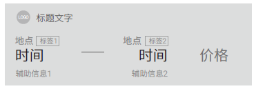
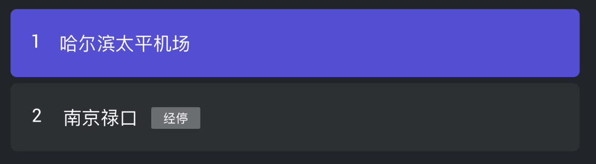
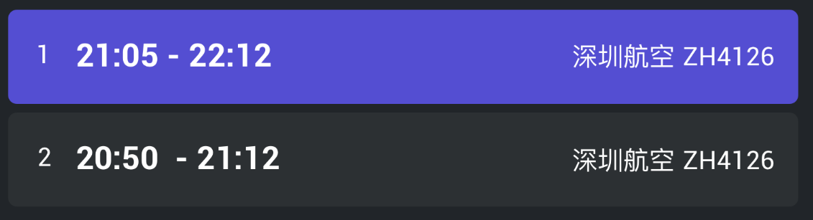

# 简介

为了减少终端解析领域Json的工作量，腾讯叮当制定了模板这一个机制。

# 模板结构
模板由一个或者多个模板单元组成。
模板单元的Json结构为

| 字段             | 类型      | 是否必须 | 意义                                       |
| -------------- | ------- | ---- | ---------------------------------------- |
| eDataType      | Integer | 必须   | 模板数据类型。不同的数据类型填充的字段不一样。所以终端需要根据模板类型解析不同的字段。 |
| strTitle       | String  | 可选   | 标题。                                      |
| strDescription | String  | 可选   | 描述。                                      |
| strContentURL  | String  | 可选   | 图片，语音，视频，音乐缩略图URL。                       |
| strDestURL     | String  | 可选   | 目标链接URL，音乐播放URL，打开应用的Scheme URL。         |
| strDownloadURL | String  | 可选   | 下载URL。                                   |
| strContentData | String  | 可选   | 文本媒体内容                                   |
| strContentID   | String  | 可选   | 内容ID                                     |
| strShareURL    | String  | 可选   | 分享URL                                    |
| strData        | String  | 可选   | 附加数据，json或文本，领域根据AIDataType来定义格式         |
示例(`听周杰伦的歌曲`回复模板)

```json
[{
	"eDataType": 5,
	"strTitle": "不该 (with amei) - 周杰伦",
	"strDescription": "QQ音乐 - 周杰伦的床边故事",
	"strContentURL": "",
	"strDestURL": "http://isure.stream.qqmusic.qq.com/M500000sxzol11raSd.mp3?guid=1600002307&vkey=E9F0E4570C1BFBE3941BA2C3B0DF2EA0FF6F557D36C741B53A44602DC5A3F3D271D48542649B4D13518B4937F3B01D330EB03085233475F5&uin=&fromtag=50",
	"strDownloadURL": "",
	"strContentData": "",
	"strContentID": "107192076",
	"strShareURL": "",
	"strData": "",
	
},
{
	"eDataType": 5,
	"strTitle": "简单爱 - 周杰伦",
	"strDescription": "QQ音乐 - 范特西",
	"strContentURL": "",
	"strDestURL": "http://isure.stream.qqmusic.qq.com/M5000009BCJK1nRaad.mp3?guid=1600002307&vkey=7409E172A2A60DB6CE29B20282F88C728B2A71163F1385C17D35D1FCED25332C1DBDB8B8593B5603F02C740405148C83C5EEBB9D1C4A8AE3&uin=&fromtag=50",
	"strDownloadURL": "",
	"strContentData": "",
	"strContentID": "97744",
	"strShareURL": "",
	"strData": "",
	
},
{
	"eDataType": 5,
	"strTitle": "七里香 - 周杰伦",
	"strDescription": "QQ音乐 - 七里香",
	"strContentURL": "",
	"strDestURL": "http://isure.stream.qqmusic.qq.com/M500004Z8Ihr0JIu5s.mp3?guid=1600002307&vkey=D1AA8D5AB360AE5AA6F4FA8B9D19DAE852BBA158D50593CBC487C1B522E9503277E7ECF1C2D76AC2C5E50C3BF515B0B9904C244FC2B3BF7F&uin=&fromtag=50",
	"strDownloadURL": "",
	"strContentData": "",
	"strContentID": "102065756",
	"strShareURL": "",
	"strData": "",
	
},
{
	"eDataType": 5,
	"strTitle": "蒲公英的约定 - 周杰伦",
	"strDescription": "QQ音乐 - 我很忙",
	"strContentURL": "",
	"strDestURL": "http://isure.stream.qqmusic.qq.com/M500004Yi5BD3ksoAN.mp3?guid=1600002307&vkey=976C126B4F674F8C094A45E3B6A62D2B3DD26044BB6A8BC2527FBDC5CE91A889F5424994A61DF56168ED8512350585C1B5FDDE8A1A65CF1F&uin=&fromtag=50",
	"strDownloadURL": "",
	"strContentData": "",
	"strContentID": "102340965",
	"strShareURL": "",
	"strData": "",
	
}]
```


# 模板类型

模板分为以下几种类型，按照不同的类型，终端需要解析模板的字段不一样。

| eDataType | 类型                     |
| --------- | ---------------------- |
| 1         | 文本                     |
| 2         | 图片                     |
| 3         | 语音                     |
| 4         | 视频                     |
| 5         | 音乐                     |
| 6         | 图文                     |
| 7         | 本地应用                   |
| 8         | 全部链接                   |
| 9         | 通用图文模版卡片               |
| 10        | 通用TAB模版卡片              |
| 11        | 文本媒体                   |
| 12        | 出行类模板卡片                |
| 13        | 通用选项模板卡片               |
| 14        | 分享卡片                   |
| 15        | 英文文本媒体。目前主要是翻译模式的tts合成 |
| 16        | raw数据。各个领域自定义，暂时没用     |
## 1. 文本模板

文本模板需要关注

- `strTitle`: 终端可以播报或者显示。

  示例：

  ```json
  [{
     "eDataType": 1, 
     "strTitle": "妻子：“你的女秘书在公司工作几年了？”丈夫：“四年。”妻子：“多大了？”丈夫：“二十多了，具体没问过。”妻子：“长的漂亮吗？”丈夫：“很一般。”妻子又问：“穿衣服怎么样？”丈夫：“很快。”", 
      "strDescription": "", 
      "strContentURL": "", 
      "strDestURL": "", 
      "strDownloadURL": "", 
      "strContentData": "", 
      "strContentID": "", 
      "strShareURL": "", 
      "strData": "", 
  }]
  ```

  ​

## 2. 图片模板

图片模板关注字段：

- `strContentURL`:图片URL

## 3. 语音模板

语音模板关注字段：

- `strContentURL`:语音URL

## 4. 视频模板

视频模板关注字段：

- `strTitle`: 视频名称
- `strDescription`:视频描述
- `strContentURL`:视频URL

## 5. 音频媒体模板

音频媒体模板需要关注

- `strTitle`: 音频的名称。
- `strDescription`: 音频的描述文字。
- `strContentURL`: 音频的外观URL。不一定有
- `strDestURL`:音频资源播放链接。
- `strContentID`:音频资源的ID。

  ​示例

```json
[{
	"eDataType": 5,
	"strTitle": "2015锤子科技-坚果发布会：漂亮得不像实力派",
	"strDescription": "",
	"strContentURL": "http://imgcache.qq.com/fm/photo/album/rmid_album_360/F/U/003y2olZ4XXcFU.jpg?time=1508860956",
	"strDestURL": "http://ws.stream.fm.qq.com/R148000AEYvH3hIvbm.m4a?fromtag=36&guid=1521974501&vkey=E5FB0C8CA47C2B2999A164A90D980E85FF180141B340EC1CA0D784AB3071F5969E4C27EC969E9D381247E116EECE132443F1940E43427CA1",
	"strDownloadURL": "",
	"strContentData": "",
	"strContentID": "rd003y2olZ4XXcFU",
	"strShareURL": "",
	"strData": "",
},
{
	"eDataType": 5,
	"strTitle": "不为输赢，就是认真",
	"strDescription": "",
	"strContentURL": "http://imgcache.qq.com/fm/photo/album/rmid_album_360/F/U/003y2olZ4XXcFU.jpg?time=1508860956",
	"strDestURL": "http://ws.stream.fm.qq.com/R148004QIK6746LX2X.m4a?fromtag=36&guid=1521974501&vkey=0ABFD29D631AEF6971B8186C31759D80D9CD4115F684F4E2AFF62955467F81923F0EFC09700F7B73B644F295CF231D0E239C22E14B6B1C0B",
	"strDownloadURL": "",
	"strContentData": "",
	"strContentID": "rd003y2olZ4XXcFU",
	"strShareURL": "",
	"strData": "",
}]
```
## 6. 图文模板

TV:问法，九州电视：南京

图文模板需要关注

- `strTitle`：图片标题
- `strDescription`：图片描述
- `strContentURL`：图片URL
- `strDestURL`:点击跳转URL。

示例：

```json
[{
	"eDataType": 6,
	"strTitle": "黑太阳南京大屠杀",
	"strDescription": "",
	"strContentURL": "http://cdn.read.html5.qq.com/image?src=video_hot&q=5&h=411&w=312&r=0&imageUrl=http%3A%2F%2Fi%2Egtimg%2Ecn%2Fqqlive%2Fimg%2Fjpgcache%2Ffiles%2Fqqvideo%2Fm%2Fmrrbgol73sl8373%5Fl%2Ejpg",
	"strDestURL": "http://v.html5.qq.com/?ch=001411#p=detail&vId=3551025&vType=1",
	"strDownloadURL": "",
	"strContentData": "",
	"strContentID": "",
	"strShareURL": "",
	"strData": "",
},
{
	"eDataType": 6,
	"strTitle": "南京！南京！ 预告片",
	"strDescription": "战争|历史",
	"strContentURL": "http://cdn.read.html5.qq.com/image?src=video_hot&q=5&h=411&w=312&r=0&imageUrl=http%3A%2F%2Fi%2Egtimg%2Ecn%2Fqqlive%2Fimg%2Fjpgcache%2Ffiles%2Fqqvideo%2Fq%2Fqb91gf5pjhaae2k%5Fl%2Ejpg",
	"strDestURL": "http://v.html5.qq.com/?ch=001411#p=detail&vId=3120771&vType=1",
	"strDownloadURL": "",
	"strContentData": "",
	"strContentID": "",
	"strShareURL": "",
	"strData": "",
}]
```

## 7. 本地应用

本地应用需要关注

- `strTitle`：应用名称
- `strDescription`：应用描述
- `strContentURL`：应用图标URL
- `strDestURL`:点击跳转URL
- `strDownloadURL`:下载地址

当收到本地应用模板时，请打开

## 8. 全部链接  

图文模板需要关注

-  `strTitle`:链接标题
-  `strDestURL`:链接URL

## 9. 通用图文模板卡片

该模板填充了：

- `strData`：通用图文卡片Json数据，见[通用图文卡片结构](#通用图文卡片结构)
- ​

## 10. 通用TAB模板卡片

该模板填充了：

- `strData`：通用图文卡片Json数据，见[通用图文卡片结构](#通用图文卡片结构)

  ​

## 11. 文本媒体

文本媒体需要关注

- `strContentData`:文本内容


## 12. 出行类模板卡片  

该模板填充了：

- `strData`：复杂卡片Json数据，见[复杂卡片结构](#复杂卡片结构)

  ​

## 13. 通用选项模板卡片   

该模板填充了：

- `strData`：复杂卡片Json数据，见[复杂卡片结构](#复杂卡片结构)

## 14. 分享卡片  

该模板较为特殊，只有在特殊领域才会用到。
该模板填充了：
- `strTitle`：分享title
- `strDescription`：分享描述
- `strShareURL`:分享链接
- `strContentData`：分析内容

示例：

```json
{
    "eDataType": 14, 
    "strTitle": "QQ浏览器帮我作了一首诗，快来发现其中的秘密！", 
    "strDescription": "QQ浏览器帮我作了一首诗，快来发现其中的秘密！", 
    "strContentURL": "http://softfile.3g.qq.com/myapp/soft_imtt/poem/20180404T113030_0933110197.mp3", 
    "strDestURL": "http://softfile.3g.qq.com/myapp/soft_imtt/poem/20180404T113030_0933110197.mp3", 
    "strDownloadURL": "http://softfile.3g.qq.com/myapp/soft_imtt/poem/20180404T113030_0933110197.mp3", 
    "strContentData": "心云云处上无尘，想见王孙一夜求。事业若能留别恨，成风见马对封侯。", 
    "strContentID": "", 
    "strShareURL": "http://smartbox.html5.qq.com/poetry?key=f6041bb4471fb3506a90d7adfc4015dd", 
    "strData": "", 
}
```


## 15. 英文文本媒体
- 该字段仅标识了模板类型，其他字段为空，用来标识回复语为英文。


# 附录

## 通用图文卡片结构


```json
{
	"strDestURL":"",        //目标链接
	"imageInfo":{
	    "strImageUrl";"",   //图片url
        "nHight":0,         //高
        "nWidth":0,         //宽
        "nRadius":0,	    //半径
        "bCorner":0	        //是否是圆角，0：尖角，1：圆角
    },
	"vecContentItems":[{            //按行排列的
		   "数字形式key":"value",
		   "数字形式key1":"value2"
		   ...
		},
		{
          	"数字形式key":"value",
		   "数字形式key1":"value2"
		   ...
		},
		...
	]
}

```
其对应的数据结构为

```c
//复杂卡片结构
struct ImageTextCommCardItem
{
    string strDestURL;				            //目标链接
    ImageInfo imageInfo;				        //图片信息
    vector<map<int, string>> vecContentItems;	//内容区信息vector代表行，map代表行内元素，map<ElementType, string>
};
struct ImageInfo
{
    string     	strImageUrl;    //图片url
    int 		nHight;         //高
    int     	nWidth;         //宽
    int 		nRadius;	    //半径
    bool		bCorner;	    //是否是圆角，0：尖角，1：圆角
};
//元素的类型，不同类型的元素在显示上可能需要不同的处理。文本元素必须从小到大依次使用
enum ElementType
{
    E_ELEMENTTYPE_STAR          = 0,    //星星元素
    E_ELEMENTTYPE_PHONE         = 1,    //电话元素
    E_ELEMENTTYPE_ADDRESS       = 2,    //地址元素
    E_ELEMENTTYPE_BUTTON        = 3,    //按钮元素
    E_ELEMENTTYPE_UPDOWN        = 4,    //上升下降 0：不变 1：上升 -1：不变
    E_ELEMENTTYPE_ICON          = 5,    //图标元素
    E_ELEMENTTYPE_TEXT1         = 100,  //文本1
    E_ELEMENTTYPE_TEXT2         = 101,  //文本2
    E_ELEMENTTYPE_TEXT3         = 102,  //文本3
    E_ELEMENTTYPE_TEXT4         = 103,  //文本4
};
```

### 通用图文模版卡片

- `imageInfo`指定左边图片的信息


- `vecContentItems`指定右边内容区域的信息，其中的字段vector<map<int,string>>的每一行对应右边信息区的一行，map跟每一行要显示的字段对应。


- `ElementType` map里面数据对应类型

样式示例：


卡片某一行对应数据示例说明：

* vector[0]-->map{<E_ELEMENTTYPE_TEXT1, "台资味台式便单">}
* vector[1]-->map{<E_ELEMENTTYPE_STAR, "3.0">, <E_ELEMENTTYPE_TEXT1, " 864条评论">}
* vector[2]-->map{<E_ELEMENTTYPE_TEXT1, "快餐简餐">，<E_ELEMENTTYPE_TEXT2, "$28/人">，<E_ELEMENTTYPE_TEXT3, "875m">}
  测试语料
- 附近的美食
- 附近有哪些特色小吃
### 通用TAB模版卡片
待补充


## 复杂卡片结构
卡片样式类型(CommonRspData.eDataType)是终端选择卡片样式的根据，每一种卡片类型对应一种卡片结构(比如：`ImageTextCommCardItem`, `ComplexCommCardItem`)，但是一种卡片结构可以对应多个卡片样式类型。

```
{
	"strDestURL":"",        //目标链接
	"strOptionValue":"",    ////选项的值。作为选项卡片的时候，应该将该值作为用户选择后的输入（参考车机航班动态的选择卡片）
 	"vecContentItems":[{            //按行排列的
		   "数字形式key":"value",
		   "数字形式key1":"value2"
		   ...
		},
		{
          	"数字形式key":"value",
		   "数字形式key1":"value2"
		   ...
		},
		...
	]
}

value的形式为：
{
   "strValue":
   "iInfoLevel":
}
```

其对应的数据结构为

```c
//复杂排列通用卡片
struct ComplexCommCardItem
{
    string strDestURL;                        //目标链接
    vector<map<int, CardElement>> vecContentElements; //内容区信息vector代表行，map代表行内元素，map<ElementType, string>
    string strOptionValue;        //选项的值。作为选项卡片的时候，应该将该值作为用户选择后的输入（参考车机航班动态的选择卡片）
};

//卡片元素
struct CardElement
{
    string  strValue;       //元素值
    int     iInfoLevel;     //元素的信息级别，ElementInfoLevel
};

// 元素信息级别，用来表示信息的层级。
enum ElementInfoLevel
{
    E_ELEMENTINFOLVL_DEFAULT    = 0,        // 默认的状态。
    E_ELEMENTINFOLVL_NORMAL     = 1,        // 正常状态。
    E_ELEMENTINFOLVL_WARMMING   = 2,        // 预警状态。
    E_ELEMENTINFOLVL_EMERGENCY  = 3         // 错误或者取消状态。
};
//元素的类型，不同类型的元素在显示上可能需要不同的处理。文本元素必须从小到大依次使用
enum ElementType
{
    E_ELEMENTTYPE_STAR          = 0,    //星星元素
    E_ELEMENTTYPE_PHONE         = 1,    //电话元素
    E_ELEMENTTYPE_ADDRESS       = 2,    //地址元素
    E_ELEMENTTYPE_BUTTON        = 3,    //按钮元素
    E_ELEMENTTYPE_UPDOWN        = 4,    //上升下降 0：不变 1：上升 -1：不变
    E_ELEMENTTYPE_ICON          = 5,    //图标元素
    E_ELEMENTTYPE_TEXT1         = 100,  //文本1
    E_ELEMENTTYPE_TEXT2         = 101,  //文本2
    E_ELEMENTTYPE_TEXT3         = 102,  //文本3
    E_ELEMENTTYPE_TEXT4         = 103,  //文本4
};
```

### 出行类模板卡片

#### 卡片定位
该卡片定位是用于出行类服务的卡片，目前交互规划的范围包括：机票、航班动态、火车票。
#### 对应卡片结构
卡片使用`ComplexCommCardItem`进行数据存放
#### 卡片数据使用说明
出行类卡片数据的存放大致按照行的形式分类，但由于不同终端的展示样式的细微差异，这一规则在不同终端上可能略有区别，具体数据的取出规则参照下表说明：

| 行    | ElementType           | 描述                                       |
| ---- | --------------------- | ---------------------------------------- |
| 1    | `E_ELEMENTTYPE_ICON`  | 图标，比如航班动态卡片的航空公司图标                       |
| 1    | `E_ELEMENTTYPE_TEXT1` | 标题文字，比如航班动态卡片航空公司及航班编号                   |
| 2    | `E_ELEMENTTYPE_TEXT1` | 起始地点                                     |
| 2    | `E_ELEMENTTYPE_TEXT2` | 起始地点标签                                   |
| 2    | `E_ELEMENTTYPE_TEXT3` | 目的地点                                     |
| 3    | `E_ELEMENTTYPE_TEXT1` | 出发时间                                     |
| 3    | `E_ELEMENTTYPE_TEXT2` | 到达时间                                     |
| 3    | `E_ELEMENTTYPE_ICON`  | 出发、到达连接图标，比如航班动态卡片中间的小飞机图标               |
| 3    | `E_ELEMENTTYPE_TEXT3` | 价格/状态，比如航班动态卡片的“起飞”、“到达”，如果有区分颜色的需求，可根据`iInfoLevel`的值对应到枚举`ElementInfoLevel`中的不同级别进行区分颜色 |
| 4    | `E_ELEMENTTYPE_TEXT1` | 辅助信息1                                    |
| 4    | `E_ELEMENTTYPE_TEXT2` | 辅助信息2                                    |


出行类模板长这样：

ComplexCommCardItem.vecContentElements解析方法
第一行：图标=E_ELEMENTTYPE_ICON, 标题文字=E_ELEMENTTYPE_TEXT1

第二行：地点1=E_ELEMENTTYPE_TEXT1，标签1=E_ELEMENTTYPE_TEXT2，地点2=E_ELEMENTTYPE_TEXT3，标签2=E_ELEMENTTYPE_TEXT4

第三行：时间1=E_ELEMENTTYPE_TEXT1，时间2=E_ELEMENTTYPE_TEXT2，价格/状态=E_ELEMENTTYPE_TEXT3，图标=E_ELEMENTTYPE_ICON

第四行：辅助信息1=E_ELEMENTTYPE_TEXT1，辅助信息2=E_ELEMENTTYPE_TEXT2
测试语料
- 航班：今天伊宁到北京的ca1234航班什么时候起飞

### 通用选项模板卡片
#### 卡片定位
该卡片定位是用于选项类的输入卡片（可以参照车机的航班动态选项卡片），这种卡片在前段具有一定的输入能力，输入文字由卡片定义（比如ComplexCommCardItem.strOptionValue）。
#### 对应卡片结构
卡片使用`ComplexCommCardItem`进行数据存放
#### 卡片数据使用说明

| 行    | ElementType           | 描述                               |
| ---- | --------------------- | -------------------------------- |
| 1    | `E_ELEMENTTYPE_TEXT1` | 选项序号                             |
| 1    | `E_ELEMENTTYPE_TEXT2` | 选项主内容，比如：车机航班动态领域的选项卡片中靠近序号一侧的内容 |
| 1    | `E_ELEMENTTYPE_TEXT3` | 选项主内容的标签                         |
| 1    | `E_ELEMENTTYPE_TEXT4` | 选项附属内容，比如：车机航班动态领域的选项卡片中右对齐的内容   |

#### 示例

+ 车机端航班动态选项卡片样式1
  

+ 车机端航班动态选项卡片样式2
  
